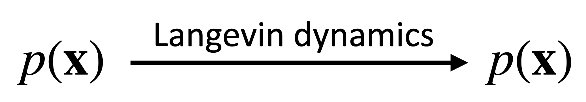

When I first learned about diffusion models, I was introduced to them as a type of variational autoencoder (VAE) applied to a series of quantities $\mathbf{x}_0, \dots, \mathbf{x}_T$. Deriving the forward and reverse processes required lengthy derivations spanning multiple pages, dense with priors, posteriors, Bayesian theorems, and mathematical intricacies. Later, I encountered the stochastic differential equation (SDE) perspective, which frames diffusion models through Fokker-Planck and Kolmogorov backward equations—concepts no simpler to grasp than the VAE approach.  

This blog series aims to provide a concise, self-contained, and rigorous introduction to diffusion models, specifically from the perspective of Langevin dynamics. While some concepts may be challenging, I believe this approach offers the fastest and most straightforward pathway to understanding diffusion model theory. We will focus exclusively on fundamental principles of stochastic differential equations (SDEs) and calculus to intuitively derive the core theory, revealing its intrinsic structure without the need for advanced machinery.

- Contents
    - [SDE and Langevin Dynamics](../fastest_way__diffusion_model_theory_i/)
    - [The Denoising Diffusion Probabilistic Model](../fastest_way__diffusion_model_theory_ii/)
    - [Training DDPM with the Denoising Objective](../fastest_way__diffusion_model_theory_iii/)
    - [ODE and Flow-Based Diffusion Model](../fastest_way__diffusion_model_theory_iv/)

# SDE and Langevin Dynamics

In this section, we cover the basics of Stochastic Differential Equations (SDEs), focusing on two fundamental concepts: 
- **Brownian noise ($d\mathbf{W}$)**: The core random process driving SDE dynamics  
- **Langevin Dynamics**: The basic SDE to generate samples from a probability distribution.

**Prerequisites**: Calculus, particularly series expansions and vector calculus (gradients, Laplacians).

## Diffusion Process

The **Diffusion Process** forms the mathematical foundation of diffusion models, describing a system's evolution through deterministic drift and stochastic noise. Here we consider a diffusion process of the following form of *stochastic differential equation (SDE)*:

$$
d\mathbf{x}_t = \boldsymbol{\mu}(\mathbf{x}_t, t) \, dt + \sigma(\mathbf{x}_t, t) \, d\mathbf{W}_t, \label{1-1}
$$

where the drift term $\boldsymbol{\mu}(\mathbf{x}_t, t) \, dt$ governs deterministic motion, while $d\mathbf{W}_t$ adds Brownian noise.

The Brownian noise $d\mathbf{W}$ is a key characteristic of SDEs, capturing their stochastic nature. It represents a series of infinitesimal Gaussian noise. A good way to understand it is through a formal definition:

$$
d\mathbf{W}_t = \sqrt{dt}\lim_{n\rightarrow\infty} \sum_{i=1}^n \sqrt{\frac{1}{n}} \boldsymbol{\epsilon}_i, 
$$

where $\boldsymbol{\epsilon}_i$ are independent standard Gaussian noises with mean $\mathbf{0}$ and identity covariance matrix $I$. The limit in this definition shows that $d\mathbf{W}$ is not just a single Gaussian random variable with mean $\mathbf{0}$, but rather the cumulative effect of infinitely many independent Gaussian increments. Such cumulation allows us to compute the covariance of $d\mathbf{W}$ as vector product:

$$
d\mathbf{W}_t \cdot d\mathbf{W}_t^T = Cov(d\mathbf{W}_t, d\mathbf{W}_t) = I \, dt,  
$$

where $I$ is the identity matrix. 

:::Note
When no quadratic terms of $d\mathbf{W}_t$ are involved, $d\mathbf{W}_t$ can often be roughly treated as $\sqrt{dt} \, \boldsymbol{\epsilon}$, where $\boldsymbol{\epsilon} \sim \mathcal{N}(0,1)$ is a standard Gaussian random variable.
:::

The Brownian noise $d\mathbf{W}_t$ scales as $\sqrt{dt}$, which fundamentally alters the rules of calculus for SDEs. A change of variable in ordinary calculus has $d s = \frac{d s}{d t} d t$, but for Brownian noise it is $d \mathbf{W}_s = \sqrt{\frac{d s}{d t}} d \mathbf{W}_t$. Moreover, the differentiation of a function is $d f(t, \mathbf{x}_t) = \partial_t f dt + \nabla_\mathbf{x} f \cdot d\mathbf{x}_t$ in ordinary calculus, but for SDE, it follows the Itô's lemma:

$$
df(t, \mathbf{x}_t) =  \partial_t f dt  + \nabla_\mathbf{x} f \cdot d \mathbf{x}_t  +  \underbrace{\frac{\sigma^2 }{2} \nabla^2_\mathbf{x} f \, dt}_{\text{stochastic effect}}. \label{Itô's lemma}
$$

This is derived by differentiating $f$ using the chain rule with the help of the SDE and covariance of $d\mathbf{W}_t$, while keeping all terms up to order $dt$ (note that $d\mathbf{W}$ scales as $\sqrt{dt}$). The emergence of the second-order Laplacian term $\nabla_\mathbf{x}^2 f$ is the key distinction from ordinary calculus. We will later use this lemma to analyze the evolution of the distribution of $\mathbf{x}_t$.

## Langevin Dynamics

**Langevin Dynamics** is a special diffusion process that aims to generate samples from a distribution $p(\mathbf{x})$. It is defined as:

$$
d\mathbf{x}_t = \mathbf{s}(\mathbf{x}_t) dt + \sqrt{2} d\mathbf{W}_t,
$$

where $\mathbf{s}(\mathbf{x}) = \nabla_{\mathbf{x}} \log p(\mathbf{x})$ is the score function.

This dynamics is often used as a Monte Carlo sampler to draw samples from $p(\mathbf{x})$, since $p(\mathbf{x})$ is its stationary distribution—the distribution that $\mathbf{x}_t$ converges to as $t \to \infty$, regardless of the initial distribution of $\mathbf{x}_0$. More precisely, this means that if an ensemble of particles at positions $\{\mathbf{x}_t^{(1)}, \mathbf{x}_t^{(2)}, \ldots, \mathbf{x}_t^{(N)}\}$ evolves according to the given SDE, and their initial positions $\{\mathbf{x}_0^{(1)}, \mathbf{x}_0^{(2)}, \ldots, \mathbf{x}_0^{(N)}\}$ follow a distribution $p(\mathbf{x})$, then their positions will continue to be distributed according to $p(\mathbf{x})$ at all future times $t > 0$.

To verify stationarity, we will show that after evolution from time $0$ to $\Delta t$, the distribution of $\mathbf{x}_{\Delta t}$ is still $p(\mathbf{x})$. Consider a test function $f$ and initial positions $\mathbf{x}_0 \sim p(\mathbf{x})$, stationary can be assessed by tracking the change in the expectation $\mathbb{E}_{\mathbf{x}_{0}\sim p(\mathbf{x})}[f(\mathbf{x}_{\Delta t})]$. Using $\eqref{Itô's lemma}$ and note that $\mathbb{E}_{\mathbf{x}}[d\mathbf{W}] = \mathbf{0}$ for any distribution of $\mathbf{x}$, we compute:

$$
\begin{aligned}
\mathbb{E}_{\mathbf{x}_0 \sim p(\mathbf{x})}\left[f(\mathbf{x}_{\Delta t}) - f(\mathbf{x}_0)\right] &\approx \Delta t \int p(\mathbf{x}) \left(\nabla_\mathbf{x} f \cdot \mathbf{s} + \nabla^2_\mathbf{x} f\right) d\mathbf{x} \quad \text{(to the first order)}\\
&= \Delta t \int f(\mathbf{x}) \left(-\nabla_\mathbf{x}\cdot(p\mathbf{s}) + \nabla^2_\mathbf{x} p\right) d\mathbf{x} \quad \text{(integration by parts)} \\
&= \Delta t \int f(\mathbf{x}) \nabla_\mathbf{x}\cdot\left(-p\mathbf{s} + \nabla_\mathbf{x} p\right) d\mathbf{x}\\
&=0,
\end{aligned}
$$

where $0$ is obtained by substituting $\mathbf{s} = \nabla_\mathbf{x} \log p$. Because $\mathbb{E}_{\mathbf{x}_0 \sim p(\mathbf{x})}\left[f(\mathbf{x}_{\Delta t}) - f(\mathbf{x}_0)\right] = 0$ for any test function $f$, this means the distribution of $\mathbf{x}_{\Delta t}$ must have been kept the same as $\mathbf{x}_0$.

## Alternative form of the Langevin Dynamics:
Recall that the term $d\mathbf{W}_t$ in Langevin dynamics scales as $\sqrt{dt}$. We can reformulate the Langevin dynamics by substituting $dt$ with $\frac{1}{2} dt$, resulting in the alternative form of the Langevin Dynamics:

$$
d\mathbf{x}_t = \frac{1}{2}\mathbf{s}(\mathbf{x}_t) dt + d\mathbf{W}_t.
$$

:::important
## Langevin Dynamics as 'Identity'

The stationary of $p(\mathbf{x})$ is very important: The Langevin dynamics for $p(\mathbf{x})$ acts as an "identity" operation on the distribution, transforming samples from $p(\mathbf{x})$ into new samples from the same distribution. This property enables what I believe is the simplest way to derive the forward and backward diffusion processes in diffusion models.

:::

## Langevin Dynamics as Monte Carlo Sampler

Langevin dynamics can be used to generate samples from a distribution $p(\mathbf{x})$, given its score function $\mathbf{s}$. But its success hinges on two critical factors. First, the method is highly sensitive to initialization - a poorly chosen $\mathbf{x}_0$ may trap the sampling process in local likelihood maxima, failing to explore the full distribution. Second, inaccuracies in the score estimation, particularly near $\mathbf{x}_0$, can prevent convergence altogether. These limitations led to the development of diffusion models, which eliminate the difficulty in choosing $\mathbf{x}_0$: all samples are generated by gradually denoising pure Gaussian noise.

## What is Next
In the [next section](../fastest_way__diffusion_model_theory_ii/), we will use Langevin dynamics as a stepping stone to derive the forward and backward diffusion processes. We will examine their mathematical formulation and how they form a dual pair—each reversing the other’s evolution.

Stay tuned for the next installment!

## Discussion
If you have questions, suggestions, or ideas to share, please visit the [discussion post](https://github.com/scraed/scraedBlog/discussions/4).

---
