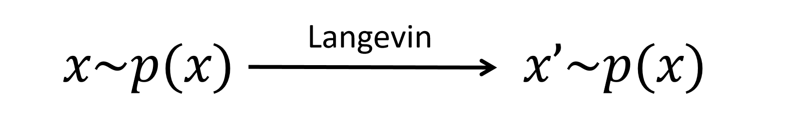

When I first learned about diffusion models, I was introduced to them as a type of variational autoencoder (VAE) applied to a series of quantities $\mathbf{x}_0, \dots, \mathbf{x}_T$. Deriving the forward and reverse processes required lengthy derivations spanning multiple pages, dense with priors, posteriors, Bayesian theorems, and mathematical intricacies. Later, I encountered the stochastic differential equation (SDE) perspective, which frames diffusion models through Fokker-Planck and Kolmogorov backward equations—concepts no simpler to grasp than the VAE approach.  

This blog series aims to provide a concise, self-contained, and rigorous introduction to diffusion models, specifically from the perspective of Langevin dynamics. The key to understanding diffusion models lies in understanding the following triangle relation: 
  
which illustrates the connection among the forward, backward diffusion process and the Langevin dynamics.

While some concepts may be challenging, I believe this approach offers the fastest and most straightforward pathway to understanding diffusion model theory. We will focus exclusively on fundamental principles of stochastic differential equations (SDEs) and calculus to intuitively derive the core theory, revealing its intrinsic structure without the need for advanced machinery.

- Contents
    - [SDE and Langevin Dynamics](../fastest_way__diffusion_model_theory_i/)
    - [The Denoising Diffusion Probabilistic Model](../fastest_way__diffusion_model_theory_ii/)
    - [Training DDPM with the Denoising Objective](../fastest_way__diffusion_model_theory_iii/)
    - [ODE and Flow-Based Diffusion Model](../fastest_way__diffusion_model_theory_iv/)


# SDE and Langevin Dynamics

In this section, we cover the basics of Stochastic Differential Equations (SDEs), focusing on two fundamental concepts: 
- **Brownian noise ($d\mathbf{W}$)**: The core random process driving SDE dynamics  
- **Langevin Dynamics**: The basic SDE to generate samples from a probability distribution.

At the end of this section, you will understand one edge of the triangle relation


**Prerequisites**: Calculus, particularly series expansions and vector calculus (gradients, Laplacians).

## Diffusion Process

The **Diffusion Process** forms the mathematical foundation of diffusion models, describing a system's evolution through deterministic drift and stochastic noise. Here we consider a diffusion process of the following form of *stochastic differential equation (SDE)*:

$$
d\mathbf{x}_t = \boldsymbol{\mu}(\mathbf{x}_t, t) \, dt + \sigma(\mathbf{x}_t, t) \, d\mathbf{W}_t, \label{SDE}
$$

where the drift term $\boldsymbol{\mu}(\mathbf{x}_t, t) \, dt$ governs deterministic motion, while $d\mathbf{W}_t$ adds Brownian noise.

:::Note
When no quadratic terms of $d\mathbf{W}_t$ are involved, $d\mathbf{W}_t$ can often be roughly treated as $\sqrt{dt} \, \boldsymbol{\epsilon}$, 
$$
d\mathbf{W}_t \approx \sqrt{dt} \, \boldsymbol{\epsilon}, 
$$
where $\boldsymbol{\epsilon} \sim \mathcal{N}(0,1)$ is a standard Gaussian random variable.
:::

Brownian noise, denoted as $d\mathbf{W}$, is a core feature of stochastic differential equations (SDEs), highlighting their random behavior. It acts like tiny bursts of Gaussian random noise.

To grasp it better, consider this formal definition:

$$
d\mathbf{W}_t = \sqrt{dt}\lim_{n\rightarrow\infty} \sum_{i=1}^n \sqrt{\frac{1}{n}} \boldsymbol{\epsilon}_i, 
$$

where each $\boldsymbol{\epsilon}_i$ is an independent standard Gaussian random variable with mean $\mathbf{0}$ and covariance matrix $I$ (the identity matrix).

This limit emphasizes that $d\mathbf{W}$ isn't simply one Gaussian random variable with mean $\mathbf{0}$. Instead, it's the buildup from countless tiny, independent Gaussian steps. This buildup lets us calculate its covariance as a vector product:

$$
d\mathbf{W}_t \cdot d\mathbf{W}_t^T = \text{Cov}(d\mathbf{W}_t, d\mathbf{W}_t) = I \, dt,  
$$

where $I$ is the identity matrix. This covariance structure reveals that $d\mathbf{W}$ has variance proportional to the infinitesimal time increment $dt$, linking it intrinsically to $dt$ while differing from ordinary calculus.

## Itô's lemma

Because Brownian noise $d\mathbf{W}_t$ scales like $\sqrt{dt}$, it bends ordinary calculus rules for SDEs.

For instance, rescaling time from $t$ to $s$ in regular calculus gives $ds = \frac{ds}{dt} dt$, but for Brownian noise $d\mathbf{W}_t$, since its scales with $\sqrt{dt}$, the transformation becomes $d \mathbf{W}_s = \sqrt{\frac{ds}{dt}} d \mathbf{W}_t$ to preserve that scaling.

Similarly, differentiating a function $f(t, \mathbf{x}_t)$ in ordinary calculus yields $df(t, \mathbf{x}_t) = \partial_t f \, dt + \nabla_\mathbf{x} f \cdot d\mathbf{x}_t$. But for SDEs, it follows the **Itô's lemma**:

$$
df(t, \mathbf{x}_t) = \partial_t f \, dt + \nabla_\mathbf{x} f \cdot d \mathbf{x}_t + \underbrace{\frac{\sigma^2}{2} \nabla^2_\mathbf{x} f \, dt}_{\text{stochastic effect}}. \label{Itô's lemma}
$$
We won't derive it step by step here. Intuitively, it comes from a Taylor expansion: plug in the SDE $\eqref{SDE}$, and since $(d\mathbf{W}_t)^2 \approx dt$, the second-order Laplacian term $\nabla^2_\mathbf{x} f$ persists as a first-order $dt$ contribution. This Laplacian highlights the key difference from deterministic calculus. We'll later use this lemma to analyze how the probability distribution of $\mathbf{x}_t$ evolves.


## Langevin Dynamics

**Langevin Dynamics** is a special diffusion process that aims to generate samples from a probability distribution $p(\mathbf{x})$. It is defined as:

$$
d\mathbf{x}_t = \mathbf{s}(\mathbf{x}_t) dt + \sqrt{2} d\mathbf{W}_t, \label{langevin dynamics}
$$

where $\mathbf{s}(\mathbf{x}) = \nabla_{\mathbf{x}} \log p(\mathbf{x})$ is the score function of $p(\mathbf{x})$. This dynamics is often used as a Monte Carlo sampler to draw samples from $p(\mathbf{x})$, since $p(\mathbf{x})$ is its stationary distribution—the distribution that $\mathbf{x}_t$ converges to and and remains at as $t \to \infty$, regardless of the initial distribution of $\mathbf{x}_0$. 

:::note
### Stationary distribution
$p(\mathbf{x})$ is the stationary distribution of the Langevin dynamics. This means:
If you start with particles whose initial positions $\{\mathbf{x}_0^{(1)}, \mathbf{x}_0^{(2)}, \ldots, \mathbf{x}_0^{(N)}\}$ already follow $p(\mathbf{x})$ (like sampling $\mathbf{x}_0$ from $p(\mathbf{x})$), then when you evolve those same particles using Langevin dynamics, their positions $\{\mathbf{x}_t^{(1)}, \mathbf{x}_t^{(2)}, \ldots, \mathbf{x}_t^{(N)}\}$ at any future time $t > 0$ will still follow $p(\mathbf{x})$. The distribution doesn't change over time.
:::

If you're comfortable assuming that $p(\mathbf{x})$ is the stationary distribution for the Langevin dynamics, that's fine. If not, here's a short proof.

To check stationarity, we show that after a small time step from 0 to $\Delta t$, the distribution of $\mathbf{x}_{\Delta t}$ remains $p(\mathbf{x})$.

Pick any smooth test function $f$. Start with initial points $\mathbf{x}_0$ drawn from $p(\mathbf{x})$. We track the change in the average value of $f$ at $\mathbf{x}_{\Delta t}$, i.e., $\mathbb{E}_{\mathbf{x}_0 \sim p(\mathbf{x})}[f(\mathbf{x}_{\Delta t})]$.

Using $\ref{Itô's lemma}$ (substitute $dt$ with $\Delta t$) and noting that the noise term averages to zero ($\mathbb{E}_{\mathbf{x}}[d\mathbf{W}] = \mathbf{0}$), we get:

$$
\begin{aligned}
\mathbb{E}_{\mathbf{x}_0 \sim p(\mathbf{x})}\left[f(\mathbf{x}_{\Delta t}) - f(\mathbf{x}_0)\right] &\approx \Delta t \int p(\mathbf{x}) \left(\nabla_\mathbf{x} f \cdot \mathbf{s} + \nabla^2_\mathbf{x} f\right) d\mathbf{x} \quad \text{(to first order)}\\
&= \Delta t \int f(\mathbf{x}) \left(-\nabla_\mathbf{x}\cdot(p\mathbf{s}) + \nabla^2_\mathbf{x} p\right) d\mathbf{x} \quad \text{(integration by parts)} \\
&= \Delta t \int f(\mathbf{x}) \nabla_\mathbf{x}\cdot\left(-p\mathbf{s} + \nabla_\mathbf{x} p\right) d\mathbf{x}\\
&=0,
\end{aligned}
$$

where the zero comes from plugging in $\mathbf{s} = \nabla_\mathbf{x} \log p$ (making the term inside the divergence vanish).

Since this average change is zero for any test function $f$, the distribution must stay unchanged.

## Alternative form of the Langevin Dynamics:
Recall that the term $d\mathbf{W}_t$ in Langevin dynamics scales as $\sqrt{dt}$. We can reformulate the Langevin dynamics by substituting $dt$ with $\frac{1}{2} dt$, resulting in the alternative form of the Langevin Dynamics:

$$
d\mathbf{x}_t = \frac{1}{2}\mathbf{s}(\mathbf{x}_t) dt + d\mathbf{W}_t.
$$

:::important
## Langevin Dynamics as 'Identity'

The stationary of $p(\mathbf{x})$ is very important: The Langevin dynamics for $p(\mathbf{x})$ acts as an "identity" operation on the distribution, transforming samples from $p(\mathbf{x})$ into new samples from the same distribution. This property enables a simple way to derive the forward and backward diffusion processes of diffusion models.


:::

## Langevin Dynamics as Monte Carlo Sampler

Langevin dynamics can be used to generate samples from a distribution $p(\mathbf{x})$, given its score function $\mathbf{s}$. But its success hinges on two critical factors. First, the method is highly sensitive to initialization - a poorly chosen $\mathbf{x}_0$ may trap the sampling process in local likelihood maxima, failing to explore the full distribution. Second, inaccuracies in the score estimation, particularly near $\mathbf{x}_0$, can prevent convergence altogether. These limitations led to the development of diffusion models, which eliminate the difficulty in choosing $\mathbf{x}_0$: all samples are generated by gradually denoising pure Gaussian noise.


## What is Next
In the [next section](../fastest_way__diffusion_model_theory_ii/), we will use Langevin dynamics as a stepping stone to derive the forward and backward diffusion processes. We will examine their mathematical formulation and how they form a dual pair—each reversing the other’s evolution.

Stay tuned for the next installment!

## Discussion
If you have questions, suggestions, or ideas to share, please visit the [discussion post](https://github.com/scraed/scraedBlog/discussions/4).


## Cite this blog
This blog is a reformulation of the appendix of the following paper.
```bibtex
@misc{zheng2025lanpainttrainingfreediffusioninpainting,
      title={LanPaint: Training-Free Diffusion Inpainting with Asymptotically Exact and Fast Conditional Sampling}, 
      author={Candi Zheng and Yuan Lan and Yang Wang},
      year={2025},
      eprint={2502.03491},
      archivePrefix={arXiv},
      primaryClass={eess.IV},
      url={https://arxiv.org/abs/2502.03491}, 
}
```
---
