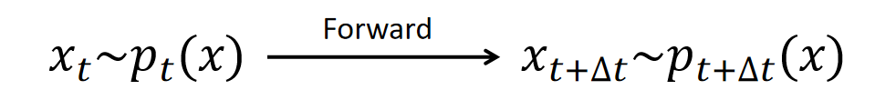
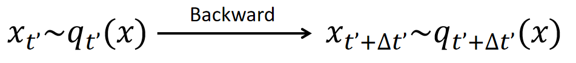
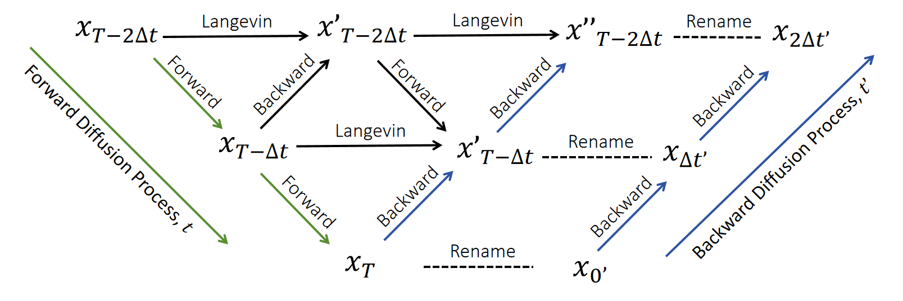

:::note[Recap]
[Previous section](../fastest_way__diffusion_model_theory_i/) introduced **Langevin Dynamics**, a special diffusion process that aims to generate samples from a distribution $p(\mathbf{x})$. It is defined as:

$$
d\mathbf{x}_t = \mathbf{s}(\mathbf{x}_t) dt + \sqrt{2} d\mathbf{W}_t,\label{Langevin Dynamics}
$$

or equivalently

$$
d\mathbf{x}_t = \frac{1}{2}\mathbf{s}(\mathbf{x}_t) dt + d\mathbf{W}_t,\label{Langevin Dynamics Alt}
$$

where $d\mathbf{W}_t$ could be roughly treated as $\sqrt{dt} \, \boldsymbol{\epsilon}$, where $\boldsymbol{\epsilon} \sim \mathcal{N}(0,1)$ is a standard Gaussian random variable. $\mathbf{s}(\mathbf{x}) = \nabla_{\mathbf{x}} \log p(\mathbf{x})$ is the score function. The Langevin dynamics for $p(\mathbf{x})$ acts as an **identity** operation on the distribution, transforming samples from $p(\mathbf{x})$ into new samples from the same distribution.
:::

In this section, we present the key processes of Denoising Diffusion Probabilistic Models (DDPMs): 
- **Forward Diffusion Process**: How DDPMs gradually corrupt an image into pure Gaussian noise  
- **Backward Diffusion Process**: How DDPMs generate images by gradually denoising pure Gaussian noise

We will show how to derive the backward diffusion process from the forward process with the help of the triangle relation:
  

**Prerequisites**: Calculus, [SDE and Langevin Dynamics](../fastest_way__diffusion_model_theory_i/).

# Spliting the Identity: Forward and Backward Processes in DDPM
s
The Denoising Diffusion Probabilistic Models (DDPMs) [^Ho2020DenoisingDP] are models that generate high-quality images from noise via a sequence of denoising steps. Denoting images as random variable $\mathbf{x}$ of the probabilistic density distribution $p(\mathbf{x})$, the DDPM aims to learn a model distribution that mimics the image distribution $p(\mathbf{x})$ and draw samples from it. The training and sampling of the DDPM utilize two diffusion process: the forward and the backward diffusion process. 

## The Forward Diffusion Process

The forward diffusion process in DDPM generates the necessary training data: clean images and their progressively noised counterparts. It gradually adds noise to existing images $\mathbf{x}_0 \sim p(x)$ using the Ornstein-Uhlenbeck diffusion process (OU process) [^Uhlenbeck1930OnTT] within a finite time interval $t\in [0,T]$. The OU process is defined by the stochastic differential equation (SDE):

$$
d \mathbf{x}_t = - \frac{1}{2} \mathbf{x}_t dt + d\mathbf{W}_t, \label{Forward Process}
$$

in which $t$ is the forward time of the diffusion process, $\mathbf{x}_t$ is the noise contaminated image at time $t$, and $\mathbf{W}_t$ is a Brownian noise.

Note that $-\mathbf{x}$ is just the score function of the standard Gaussian distribution $\mathcal{N}(\mathbf{0},I)$. Thus, the forward diffusion process corresponds to the Langevin dynamics of the standard Gaussian $\mathcal{N}(\mathbf{0},I)$.

The forward diffusion process has $\mathcal{N}(\mathbf{0},I)$ as its stationary distribution. This means, for any initial distribution $p_0(\mathbf{x})$ of positions $\{\mathbf{x}_0^{(1)},...,\mathbf{x}_0^{(N)}\}$, their density $p_t(\mathbf{x})$ converges to $\mathcal{N}(\mathbf{0},I)$ as $t\to\infty$. When these positions represent vectors of clean images, the process describes a gradual noising operation that transforms clean images into Gaussian noise.

One forward diffusion step with a step size of $\Delta t$ is displayed in the following picture.

## The Backward Diffusion Process

The backward diffusion process is the conjugate of the forward process. While the forward process evolves $p_t(\mathbf{x})$ toward $\mathcal{N}(\mathbf{0},I)$, the backward process reverses this evolution, restoring $\mathcal{N}(\mathbf{0},I)$ to $p_t$.

To derive it, we employ Langevin dynamics as a stepping stone, which provides the fastest way to obtain the backward diffusion process: 

:::note
$\ref{Langevin Dynamics}$ acts as an "identity" operation on a distribution. Thus, the composition of forward and backward processes, at time $t$, must yield the Langevin dynamics for $p_t(\mathbf{x})$. As shown in the following picture

:::

To formalize this, consider the Langevin dynamics for $ p_t(\mathbf{x}) $ with a distinct time variable $ \tau $, distinguished from the forward diffusion time $ t $. This dynamics can be decomposed into forward and backward components as follows:  

$$
\begin{split}  
d\mathbf{x}_\tau &= \mathbf{s}(\mathbf{x}_\tau, t) d\tau + \sqrt{2}\, d\mathbf{W}_\tau, \\
&= \underbrace{-\frac{1}{2} \mathbf{x}_\tau d\tau + d\mathbf{W}_\tau^{(1)}}_{\text{Forward}} + \underbrace{ \left( \frac{1}{2} \mathbf{x}_\tau + \mathbf{s}(\mathbf{x}_\tau, t) \right)d\tau + d\mathbf{W}_\tau^{(2)}}_{\text{Backward} },  
\end{split}  
$$

where $ \mathbf{s}(\mathbf{x}, t) = \nabla_{\mathbf{x}} \log p_t(\mathbf{x}) $ is the score function of $ p_t(\mathbf{x}) $. We have utilized the property that $\sqrt{2}\, d\mathbf{W}_\tau = \sqrt{2 dt} \boldsymbol{\epsilon} = \sqrt{dt} \boldsymbol{\epsilon}_1 + \sqrt{dt} \boldsymbol{\epsilon}_2 = d\mathbf{W}_\tau^{(1)} + d\mathbf{W}_\tau^{(2)}$. 

The "Forward" part in this decomposition corresponds to the forward diffusion process, effectively **increasing the forward diffusion time $ t $ by $ d\tau $**, bringing the distribution to $p_{t + d\tau}(\mathbf{x})$. Since the forward and backward components combine to form an "identity" operation, the "Backward" part must reverse the forward process—**decreasing the forward diffusion time $ t $ by $ d\tau $** and restoring the distribution back to $ p_t(\mathbf{x}) $.

Now we can define the backward process according to the backward part in the equation above, and a backward diffusion time $t'$ different from the forward diffusion time $t$:

$$
d\mathbf{x}_{t'} = \left( \frac{1}{2} \mathbf{x}_{t'}+ \mathbf{s}(\mathbf{x}_{t'}, t) \right) dt' + d\mathbf{W}_{t'}.
$$

One step of this backward diffusion process with $dt' = \Delta t$ acts as a reversal of the forward process.

The backward diffusion process itself is also a standalong SDE that advances the backward diffusion time $t'$

These two interpretations help us determine the relationship between the forward diffusion time $t$ and the backward diffusion time $t'$. Since $dt'$ is interpreted as a "decrease" in the forward diffusion time $t$, we have 

$$
dt = -dt'
$$

which means the backward diffusion time is the inverse of the forward. To make $t'$ lies in the same range $[0, T]$ of the forward diffusion time, we define $t = T - t'$. In this notation, the backward diffusion process [^Anderson1982ReversetimeDE] is

$$
d\mathbf{x}_{t'} = \left( \frac{1}{2} \mathbf{x}_{t'}+ \mathbf{s}(\mathbf{x}_{t'}, T-t') \right) dt' + d\mathbf{W}_{t'}, \label{Backward Process}
$$

in which $t' \in [0,T]$ is the backward time, $\mathbf{s}(\mathbf{x}, t) = \nabla_{\mathbf{x}} \log p_t(\mathbf{x})$ is the score function of the density of $\mathbf{x}_{t}$ in the forward process.

### Forward-Backward Duality

The forward and backward processes form a dual pair, advancing the time $t'$ means receding time $t$ by the same amount. The following figure illustrates consecutive steps of $\ref{Forward Process}$ and $\ref{Backward Process}$.

**Each horizontal row in this picture corresponds to consecutive steps of Langevin dynamics, which alters the samples while maintaining the same probability density**. The green arrows represent consecutive forward process steps that advance the forward diffusion time $t$, while the blue arrows indicate consecutive backward process steps that advance the backward diffusion time $t'$. This illustrates the duality between the forward and backward diffusion processes: while $\mathbf{x}_t$ (forward) and $\mathbf{x}_{(T-t)'}$ (backward) are distinct samples, they obey the same probability distribution.

:::tip
It's important to note that the backward diffusion process does not generate identical samples to the forward process; rather, it produces samples according to the same probability distribution, due to the identity property of Langevin dynamics.
:::

To formalize the duality, we define the densities of $\mathbf{x}_t$ (forward) as $p_t(\mathbf{x})$, the densities of $\mathbf{x}_{t'}$ (backward) as $q_{t'}(\mathbf{x})$. If we initialize

$$
q_0(\mathbf{x}) = p_T(\mathbf{x}),  
$$

then their evolution are related by  

$$
q_{t'}(\mathbf{x}) = p_{T-t'}(\mathbf{x}) 
$$

For large $T$, $p_T(\mathbf{x})$ converges to $\mathcal{N}(\mathbf{x}|\mathbf{0},I)$. Thus, the backward process starts at $t'=0$ with $\mathcal{N}(\mathbf{0},I)$ and, after evolving to $t'=T$, generates samples from the data distribution:  

$$
q_T(\mathbf{x}) = p_0(\mathbf{x}) \quad \text{(data distribution)}.  
$$
This establishes an exact correspondence between the forward diffusion process and the backward diffusion process, indicating that the backward diffusion process can generate image data from pure Gaussian noise.

## What is Next
We demonstrated that **backward diffusion**—the dual of the forward process—can generate image data from noise. However, this requires access to the **score function** $\mathbf{s}(\mathbf{x}, t) = \nabla_{\mathbf{x}} \log p_t(\mathbf{x})$ at every timestep $t$. In practice, we approximate this function using a neural network.  In the [next section](../fastest_way__diffusion_model_theory_iii/), we will explain how to train such score networks.  

Stay tuned for the next installment!

## Discussion
If you have questions, suggestions, or ideas to share, please visit the [discussion post](https://github.com/scraed/scraedBlog/discussions/4).

[^Ho2020DenoisingDP]: Ho, J., Jain, A., & Abbeel, P. (2020). Denoising diffusion probabilistic models. Advances in neural information processing systems, 33, 6840-6851.
[^Uhlenbeck1930OnTT]: Uhlenbeck, G. E., & Ornstein, L. S. (1930). On the theory of the Brownian motion. *Physical Review*, *36*(5), 823–841.  
[^Anderson1982ReversetimeDE]: Anderson, B. D. O. (1982). Reverse-time diffusion equation models. *Stochastic Processes and their Applications*, *12*(3), 313–326.  

---
